# Go-Virtual Architecture Diagram

## System Overview

**Go-Virtual** is a single-binary API proxy/mock service that virtualises OpenAPI 3 specifications.
It follows a **layered monolith** architecture with an embedded React SPA, pluggable storage,
Starlark scripting, session-aware KV store, spec-scoped AI/proxy fallback policy, AI scenarios,
live tracing over WebSocket, Prometheus metrics, and optional TLS on a protocol-sniffing
multiplexed listener.

---

## Component Architecture

```mermaid
flowchart TB
    subgraph CLIENT["Client Layer"]
        Browser["Browser / Admin UI\n(React 18 + TypeScript + Vite)"]
        APIClient["External API Client\n(curl / SDK / Service)"]
        PromScraper["Prometheus Scraper"]
        WSClient["WebSocket Client\n(Trace Viewer)"]
    end

    subgraph CLI["CLI (cobra/viper)"]
        ServeCmd["serve command"]
        VersionCmd["version command"]
    end

    subgraph SERVER["Go HTTP Server (net/http)"]
        TLSMux["TLS Mux Listener\n(tlsutil — HTTP + HTTPS on same port)"]
        GinRouter["Gin Router\n(internal/api/router)"]
    end

    subgraph ADMIN["Admin API  /_api/*"]
        HSpecs["Specs Handler"]
        HOps["Operations Handler"]
        HResp["Responses Handler"]
        HScripts["Scripts Handler"]
        HStore["Store Handler"]
        HSessions["Sessions Handler"]
        HTraces["Traces Handler"]
        HStats["Stats Handler"]
        HArchive["Archive Handler"]
        HAI["AI Handler"]
        HSystem["System/Health/Branding"]
    end

    subgraph PROXY_ENGINE["Proxy Engine  (internal/proxy)"]
        SavedResponses["Saved Response Lookup\n(configured → recorded)"]
        ModeSelector["Spec Mode Selector\n(spec policy AI → proxy → standard)"]
        MockMode["Configured Response Path\n(condition → script → template)"]
        AIFallback["Runtime AI Fallback\n(optional AI scenario)"]
        ProxyMode["Proxy Fallback\n(reverse proxy to upstream)"]
        RecordMode["Recorder\n(save proxy/AI responses)"]
        ProxyClient["HTTP Client\n(mTLS support)"]
    end

    subgraph CORE["Core Services"]
        Parser["OpenAPI Parser\n(kin-openapi)"]
        TemplateEng["Template Engine\n(internal/template)"]
        CondEval["Condition Evaluator\n(internal/condition)"]
        ScriptEng["Starlark Script Engine\n(internal/scripting)"]
        ScriptCache["Script Compile Cache\n(LRU by scriptID+updatedAt)"]
        AIGen["AI Generator\n(internal/ai)"]
    end

    subgraph DATA["Data Layer"]
        Storage["Storage Interface\n(internal/storage)"]
        MemStorage["Memory Storage"]
        FileStorage["File Storage\n(./data/*.json)"]
        GlobalStore["GlobalStore\n(internal/store — store.json)"]
        SessionMgr["Session Manager\n(per-request ephemeral KV)"]
    end

    subgraph OBS["Observability"]
        TracingSvc["Tracing Service\n(internal/tracing — ring buffer)"]
        WSHandler["WebSocket Handler\n(live trace stream)"]
        StatsColl["Stats Collector\n(internal/stats)"]
        PromMetrics["Prometheus Metrics\n(internal/metrics)"]
    end

    subgraph INFRA["Infrastructure / Config"]
        ConfigMgr["Config Loader\n(internal/config + viper)"]
        TLSUtil["TLS Certificate Manager\n(internal/tlsutil — auto self-signed)"]
        ArchiveMgr["Archive Manager\n(internal/archive — zip bundles)"]
    end

    subgraph EXTERNAL["External Systems"]
        OpenAI["OpenAI API\n(runtime + admin generation)"]
        Upstream["Upstream Backend\n(real API server)"]
        PromServer["Prometheus / Grafana"]
    end

    %% Client → Server
    Browser -->|"HTTP/HTTPS  /_ui/*"| TLSMux
    APIClient -->|"HTTP/HTTPS  /*"| TLSMux
    PromScraper -->|"HTTP  /_prometheus"| TLSMux
    WSClient -->|"WebSocket  /_api/traces/stream"| TLSMux

    %% Server routing
    TLSMux --> GinRouter
    GinRouter -->|"/_api/*"| ADMIN
    GinRouter -->|"proxy paths"| PROXY_ENGINE
    GinRouter -->|"/_prometheus"| PromMetrics
    GinRouter -->|"WS upgrade"| WSHandler

    %% Admin → Core
    HSpecs --> Parser
    HSpecs -->|"spec mode policy + AI scenarios"| Storage
    HResp --> TemplateEng
    HScripts --> ScriptEng
    HAI -->|"generate response/script"| AIGen

    %% Admin → Data
    ADMIN --> Storage
    HStore --> GlobalStore
    HSessions --> SessionMgr

    %% Proxy Engine internals
    PROXY_ENGINE --> SavedResponses
    PROXY_ENGINE --> ModeSelector
    SavedResponses --> Storage
    ModeSelector --> CondEval
    MockMode --> CondEval
    MockMode --> ScriptEng
    MockMode --> TemplateEng
    AIFallback --> AIGen
    ProxyMode --> ProxyClient
    ProxyClient -->|"HTTP/HTTPS + mTLS"| Upstream
    ProxyMode --> RecordMode
    AIFallback --> RecordMode
    RecordMode --> Storage

    %% Proxy Engine → Data
    PROXY_ENGINE --> Storage
    PROXY_ENGINE --> SessionMgr

    %% Scripting
    ScriptEng --> ScriptCache
    ScriptEng -->|"store.get/set/has/delete"| SessionMgr
    SessionMgr -->|"snapshot seed"| GlobalStore

    %% AI wiring
    AIGen -->|"runtime + admin prompts"| OpenAI

    %% Observability wiring
    PROXY_ENGINE --> TracingSvc
    PROXY_ENGINE --> StatsColl
    PROXY_ENGINE --> PromMetrics
    TracingSvc --> WSHandler
    WSHandler -->|"JSON frames"| WSClient
    PromMetrics -->|"exposition format"| PromServer

    %% Storage backends
    Storage --> MemStorage
    Storage --> FileStorage

    %% Config & TLS wiring
    ConfigMgr --> ServeCmd
    ServeCmd --> TLSUtil
    TLSUtil --> TLSMux
    ServeCmd --> ArchiveMgr

    %% Archive
    HArchive --> ArchiveMgr
    ArchiveMgr --> Storage
    ArchiveMgr --> GlobalStore
```

---

## Component Descriptions

| Component | Package | Responsibility |
|---|---|---|
| CLI | `cmd/server` | Entry point; `serve` and `version` cobra commands; flag/config binding via viper |
| Gin Router | `internal/api/router` | HTTP routing, CORS, middleware, UI/docs file-serving |
| Admin Handler | `internal/api/handler*` | CRUD for specs, operations, responses, scripts, store, sessions, archives, AI, stats, traces |
| Proxy Engine | `internal/proxy/engine` | Resolves requests through configured responses, recorded replay, then spec-scoped AI/proxy/standard fallback |
| OpenAPI Parser | `internal/parser` | Parses OpenAPI 3 YAML/JSON specs via kin-openapi |
| Template Engine | `internal/template` | Renders response bodies/headers with `{{.path.*}}`, `{{.script.*}}`, `{{.random.*}}` etc. |
| Condition Evaluator | `internal/condition` | Evaluates `eq`, `contains`, `regex`, `gt`, `in`, … operators against request fields |
| Starlark Engine | `internal/scripting` | Sandboxed script execution; `store.*` and `log()` builtins; LRU compile cache |
| Storage | `internal/storage` | Pluggable persistence — in-memory or JSON files under `./data/` |
| GlobalStore | `internal/store/global` | Application-wide persistent KV store backed by `store.json` |
| Session Manager | `internal/store/manager` | Creates/expires ephemeral per-request sessions seeded from GlobalStore snapshot |
| Tracing Service | `internal/tracing` | In-memory ring buffer of request traces; fan-out to WebSocket subscribers |
| WebSocket Handler | `internal/tracing/websocket` | Upgrades HTTP to WebSocket; streams trace events in real-time |
| Stats Collector | `internal/stats` | Counters and latency histograms per spec/operation |
| Prometheus Metrics | `internal/metrics` | Exposes metrics at `/_prometheus` in Prometheus exposition format |
| TLS Util | `internal/tlsutil` | Protocol-sniffing mux listener; auto-generates self-signed cert if none configured |
| Archive Manager | `internal/archive` | Exports/imports full state (specs + store) as zip archives |
| AI Generator | `internal/ai` | Calls OpenAI for admin generation and runtime AI fallback, including named AI scenarios |
| React SPA | `ui/` | Admin dashboard — spec manager, AI scenarios, recorded responses, response designer, script editor, trace viewer, store/session inspector |
