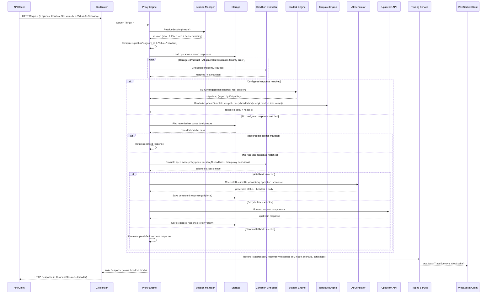

# Sequence Diagram: Incoming Request Resolution

This diagram traces the current request lifecycle in Go-Virtual, including
saved-response lookup, recorded-response replay, spec-level fallback policy,
global AI scenarios, and proxy recording.

## Notes

- **Session resolution**: if the `X-Virtual-Session-Id` header is absent or unknown, a new session
  is created and its UUID is echoed back in the response header. Sessions expire after the
  configured `inactivityTimeout` (default 30 min).
- **Saved response order**: configured/manual and pre-generated AI responses are tried first by
  priority, then recorded responses are matched by signature, then runtime fallback policy runs.
- **Spec fallback policy**: AI and proxy are enabled or disabled at the spec level, with
  optional per-request conditions evaluated in sequence. Standard fallback is always available last.
- **AI scenarios**: callers can send `X-Virtual-AI-Scenario` to steer runtime AI output toward a
  named global scenario (for example `success`, `client_error`, `server_error`, or custom cases).
- **Script bindings**: executed in declaration order; each binding's return value is stored under
  `outputKey` and available in templates as `{{.script.<outputKey>.<field>}}`.
- **Recorded response hashing**: all `X-Virtual-*` headers are ignored when computing the request
  signature so internal control headers do not fragment replayed recordings.
- **Tracing**: only emitted when tracing is enabled on the spec. Traces now include response tier,
  selected fallback mode, AI skip reasons, proxy skip reasons, and requested/applied AI scenarios.
