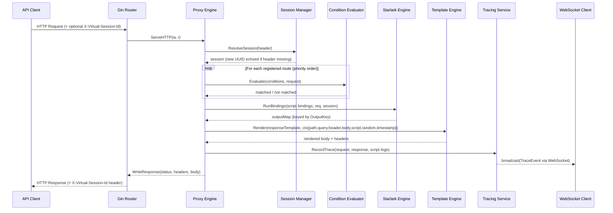

# Sequence Diagram: Incoming Mock Request

This diagram traces the full lifecycle of a request handled in **Mock Mode** —
the most common path through Go-Virtual.

## Notes

- **Session resolution**: if the `X-Virtual-Session-Id` header is absent or unknown, a new session
  is created and its UUID is echoed back in the response header. Sessions expire after the
  configured `inactivityTimeout` (default 30 min).
- **Condition evaluation**: response configs are evaluated in ascending priority order; the first
  match wins. If no config matches and `exampleFallback` is enabled, the OpenAPI example is used.
- **Script bindings**: executed in declaration order; each binding's return value is stored under
  `outputKey` and available in templates as `{{.script.<outputKey>.<field>}}`.
- **Tracing**: only emitted when tracing is enabled on the spec. Live trace events are broadcast
  to all connected WebSocket clients immediately after the response is written.
