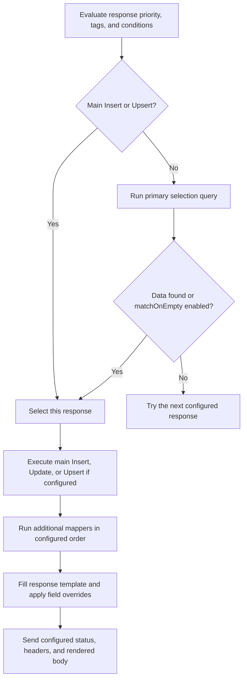

# Collection responses: selection, mapper operations, and rendering

A collection response selects a configured response using conditions and, for read/Update operations, a collection query, then builds its JSON body from the primary mapper result and optional additional mapper outputs. It participates in the normal response priority, enabled state, tag, and explicit-condition checks.

The primary mapper supports **Find One**, **Find Many**, **Insert**, **Update**, and **Upsert**. Additional mappers support **Insert**, **Find One**, **Find Many**, **Update**, **Upsert**, and **Delete**.

## 1. Request lifecycle



Selection is read-only. Main Insert and Upsert use only response conditions for selection: no collection lookup or filter binding resolution occurs at this stage. With no conditions they are eligible unconditionally, subject to normal priority, tags, enabled state, and session availability. Insert creates one document after selection. Upsert resolves its required filters after selection, then updates the first matching document or inserts when none matches. Both require data fields and an object response root. Their resulting document becomes the primary output for rendering and additional mappers. Insert does not accept filters; Upsert filters do not affect response eligibility. A binding or execution failure after selection returns an error without falling through to another response.

For a primary Update, the selection query is Find One using the configured query filters. Only the selected response performs writes. The selected document is retained by identity; the original query is not repeated after an update.

For example, a query may require `status = pending`, and the Update may set `status = confirmed`. The response is still selected and renders the confirmed document, even though the updated document no longer satisfies the old filter.

## 2. Select the response template first

The renderer resolves the OpenAPI response for the operation's **configured status code** and optional named example (`templateRef`). It uses the JSON response example as a structural template, or a schema-generated example when available.

Choose a status code that actually defines the intended response body. If a PUT operation defines its Person response under **202**, configuring the collection response as **200** does not use the 202 template. With no matching body, rendering enters **identity mode** and returns the primary document directly, with overrides applied.

In template mode:

- An object template uses Find One by default.
- An array template uses Find Many by default, filling the first template item for each primary result document.
- Primary Insert, Update, and Upsert require an object template. Update changes one selected document; Insert and Upsert produce their document after selection.
- An explicit main mode must agree with the template's object/array root.

In identity mode, choose `rootKind: "object"` or `"array"`. Primary Insert, Update, and Upsert still require an object root. An omitted main mode preserves the existing automatic shape-based choice.

### Response shape resolution

Rendering combines the selected example with declared schema properties and array items. Schema definitions fill gaps in incomplete examples, including empty arrays and schema-only responses. References and allOf property definitions are resolved; ambiguous oneOf/anyOf alternatives require a representative example. Recursive schema expansion stops at cycles. Free-form additionalProperties do not authorize copying arbitrary source fields. This is structural projection, not a complete JSON Schema validator.

A missing named example can also leave no matching template. Check the status code, example selection, and trace's template source when output does not have the expected shape.

## 3. How the primary output fills the response

The renderer walks template paths and looks up corresponding paths in the primary result. It does not automatically nest a flat primary document inside a response envelope.

Suppose the response example is:

```json
{
  "id": "example-id",
  "name": "Example name",
  "profile": { "city": "Unknown" },
  "planLabel": "Free"
}
```

And the primary Find One or Update result is:

```json
{
  "_id": "internal-42",
  "id": "42",
  "name": "Asha",
  "profile": { "city": "Pune", "internalCode": "P01" },
  "planId": "pro",
  "internalNote": "collection-only value"
}
```

Without overrides, the rendered response is:

```json
{
  "id": "42",
  "name": "Asha",
  "profile": { "city": "Pune" },
  "planLabel": "Free"
}
```

Only fields visited in the template are projected. `_id`, `planId`, `internalNote`, and `profile.internalCode` are omitted. `planLabel` falls back to the example because it is absent from the primary document.

For an envelope such as `{"person":{"id":"example-id"}}`, either the primary document needs a matching `person.id` path, or configure an override for target `person.id` with source **Document field**, key `id`.

### Field precedence and missing values

| Situation | Template-mode behavior |
| --- | --- |
| Explicit override exists at a visited target path | Resolve and use that value first |
| No effective override and a root field matches an additional mapper output key | Use the mapper result and project it through that field’s response shape |
| No matching mapper output and the primary document has the leaf path | Use the document value |
| Document leaf is absent and `fallbackToExample` is true or omitted | Use the example value and record a warning |
| Document leaf is absent and `fallbackToExample` is false | Render null and record a warning |
| Document leaf is explicitly null, false, zero, or an empty string | Preserve it; it is not missing |
| Explicit override cannot resolve its source and has no default | Render null and record a warning; do not fall back to the example |

Objects are walked recursively. An incompatible object value produces a warning and its template children are still processed. Missing or incompatible array values render as `[]`; a nonempty array example supplies the item projection. For an empty array example, schema items supply the shape. Without an item shape, source items are omitted with a warning; source fields are never copied wholesale.

An override selects the source value for a target. Objects and arrays are then projected recursively through that target’s response shape, including renamed objects and arrays. Explicit child overrides are applied during projection; `addresses.city` applies to every address and `addresses.0.city` overrides the first item specifically. Overrides cannot add fields absent from the resolved shape. A mapped object/array with no usable shape produces an empty container or null with a diagnostic instead of leaking its fields.

Identity mode retains the primary document and permits scalar overrides. Object/array overrides require a response shape and are skipped with a warning in identity mode. Automatic additional-mapper matching requires template mode.

## 4. How additional outputs enter the response

Each additional mapper has a unique `outputKey`. Its result is stored under that key for field overrides. When an output key matches a response root field, that output automatically supplies the field before the primary document is considered. Only fields already defined by the response shape are eligible; unrelated mapper outputs add no fields. On an array-root response, the convention applies to each primary item using the same additional outputs.

For example, an additional Find One mapper with output key `plan` might return:

```json
{ "_id": "pro", "label": "Professional", "monthlyPrice": 25 }
```

Configure this Output override:

| Target path in response template | Source | Source key |
| --- | --- | --- |
| `planLabel` | Mapper output | `plan.label` |

The preceding primary/template example now renders `"planLabel": "Professional"`. It does not add a top-level `plan` object, `_id`, or `monthlyPrice`.

Mapper source keys accept `<outputKey>` for the whole object/array or `<outputKey>.<path>` for a nested value. For example, target `addrs` with key `addresses` projects the whole addresses result through the addrs shape; `addresses.0.city` selects the first address’s city for a leaf override.

Additional mappers execute once per selected response, in list order, even when the primary result is an array. The same additional output map is available while rendering every primary item. These are not per-item joins: `primary` source bindings are rejected for array-root responses, and additional mappers cannot bind to earlier mapper outputs. Later operations can still observe earlier writes by querying the same session collection state.

### Operation results

| Mode | Filters | Data fields | Result under the output key |
| --- | --- | --- | --- |
| Find One | Optional | None | First matching document or null |
| Find Many | Optional | None | Matching documents as an array, possibly empty |
| Insert | None | Required | Inserted document, including its ID |
| Update | Required | Required | First matching document after changes, or null |
| Upsert | Required | Required | Updated document, or inserted document if no match |
| Delete | Required | None | Removed document before deletion, or null |

Results are plain documents, arrays, or null, without pipeline `_status` fields. Update and Delete affect the first matching document. Find Many in the primary mapper does not turn additional Update into update-many.

## 5. Complete Update example with additional outputs

Assume the operation is `PUT /people/{personId}` and its OpenAPI **202** response media-type example is:

```json
{
  "id": "example-id",
  "name": "Example name",
  "status": "pending",
  "planLabel": "Free",
  "auditId": "example-audit"
}
```

The `people` collection contains a document with `_id: "person-42"`, `id: "42"`, `name: "Asha"`, `status: "pending"`, and `planId: "pro"`. The `plans` collection contains `_id: "pro"` with `label: "Professional"`.

This is a response configuration payload fragment; provide normal response metadata such as name and enabled state when saving:

```json
{
  "kind": "collection",
  "statusCode": 202,
  "collectionResponse": {
    "primary": {
      "mode": "update",
      "collectionName": "people",
      "filterRules": [
        { "targetPath": "id", "value": { "source": "path", "key": "personId" } },
        { "targetPath": "status", "value": { "source": "literal", "value": "pending" } }
      ],
      "dataRules": [
        { "targetPath": "name", "value": { "source": "body", "key": "name" } },
        { "targetPath": "status", "value": { "source": "literal", "value": "confirmed" } }
      ]
    },
    "additionalMappers": [
      {
        "outputKey": "plan",
        "mode": "find-one",
        "collectionName": "plans",
        "filterRules": [
          { "targetPath": "_id", "value": { "source": "primary", "key": "planId" } }
        ]
      },
      {
        "outputKey": "audit",
        "mode": "insert",
        "collectionName": "person_events",
        "dataRules": [
          { "targetPath": "personId", "value": { "source": "primary", "key": "id" } },
          { "targetPath": "status", "value": { "source": "primary", "key": "status" } }
        ]
      }
    ],
    "overrides": [
      { "targetPath": "planLabel", "value": { "source": "mapper", "key": "plan.label" } },
      { "targetPath": "auditId", "value": { "source": "mapper", "key": "audit._id" } }
    ],
    "fallbackToExample": true
  }
}
```

Send `PUT /people/42` with this body:

```json
{ "name": "Asha Rao" }
```

Execution proceeds as follows:

1. Query `people` for `id = "42"` and `status = "pending"`. This selects the response.
2. Update that exact document to `name = "Asha Rao"`, `status = "confirmed"`. Retain its other fields, including `planId`.
3. Read the plan using the updated primary result's `planId`.
4. Insert an audit document using the updated primary `id` and `status`. Its generated `_id` is available as `audit._id`.
5. Fill `id`, `name`, and `status` by matching paths from the primary result; resolve `planLabel` and `auditId` through overrides.

The **202** body is:

```json
{
  "id": "42",
  "name": "Asha Rao",
  "status": "confirmed",
  "planLabel": "Professional",
  "auditId": "<generated audit document ID>"
}
```

The primary collection's internal `_id` and `planId` stay out of the response because they are not template fields. The audit ID appears because an override explicitly selects it.

## 6. Binding sources and snapshots

| Binding location | Available sources | Meaning of primary/document |
| --- | --- | --- |
| Primary query filters | Path, query, header, body, literal | No primary document exists yet |
| Primary Insert/Upsert data | Request/literal sources | No primary document exists before execution |
| Primary Update data | Request/literal sources and primary | Primary is the selected document before Update |
| Additional mapper filters/data | Request/literal sources and primary | Primary is the main mapper result after any configured write |
| Output field overrides | Request/literal sources, document, mapper | Document is the primary item currently being rendered; mapper is a named additional result |

Use **Document field** in an output override to read the current primary item. Use **Mapper output** to read a named additional result. Use **Primary document** in an additional mapper's bindings to select related data or write fields from the main result.

Additional operations observe session writes in execution order. However, each operation's returned result is a snapshot. If a later additional mapper modifies or deletes the primary document, the main render snapshot is not automatically replaced. To expose that later result, reference its output key in an override. An additional Delete result contains the document before removal, so its fields remain usable for rendering.

Literal and body values preserve JSON types. Path, query, and header inputs are strings. Write data merges top-level fields; replace a complete nested object to change it. Dotted write targets and changing `_id` through Update/Upsert data are rejected. A missing mutation filter/data source uses its configured default, or raises an error rather than omitting a filter or field; explicit null remains a value.

## Optional defaults when a source is missing

Every nonliteral filter, data binding, and output override can specify `defaultValue`. In the editor, enable **Use default value** on the binding row and enter a JSON value. Strings need quotes; `true`, `0`, `null`, `{}`, and `[]` are also valid defaults.

```json
{
  "targetPath": "planLabel",
  "value": {
    "source": "mapper",
    "key": "plan.label",
    "defaultValue": "Free"
  }
}
```

If `plan` has no result or no `label` field, this override renders `"Free"`. An existing label wins, including an empty string or explicit null. Defaults apply to absence, not falsy values. Invalid bindings and mapper execution errors still fail; defaults do not hide them.

The same setting works for primary query filters, primary Insert/Update/Upsert data, and additional mapper filter/data fields. A missing write binding with a default satisfies the required-value check. A defaulted read/Update query still needs to find real collection data for response selection unless matchOnEmpty is enabled. Upsert filters are used only during execution.

Resolution order is **mapped source → binding default if absent → existing missing-value behavior**. An explicit override with neither a value nor a default still produces null with a warning in template mode, regardless of `fallbackToExample`. That option continues to control convention-filled fields without overrides. Object/array defaults are projected through the target shape, just like mapper overrides.

Defaults are preserved in response save/clone/archive operations and are available in read-only preview. Turn the option off to remove the default. Switching the source to Literal removes the unused default.

## 7. Empty results, previews, and failures

- An empty primary result normally rejects the candidate and tries the next response without writing.
- Insert and Upsert ignore `matchOnEmpty`; their selection has no collection-data prerequisite.
- With `matchOnEmpty`, an empty object response renders null and an empty array response renders `[]`. An empty primary Update performs no write and never implicitly upserts.
- Additional request/literal-based operations can still run when an empty primary is selected. A required primary binding fails if no primary document exists.
- Additional Update/Delete with no match is a successful no-op with a null output. An override trying to read a field from that result uses its default if configured; otherwise it cannot resolve it.
- Preview performs reads only. It renders the pre-update main document for Update, returns null for a main Insert/Upsert whose write result does not yet exist, skips additional writes, and reports warnings. It cannot show post-write values that would exist only after actual execution. Saving and validation never run mapper operations.
- Writes are session scoped and leave base collection data unchanged. Resume the same session to observe prior writes.
- After selection, a runtime failure returns an error; it does not select another response or automatically retry writes. Earlier committed operations remain if a later operation or rendering fails. There is no transaction across mapper operations.

## 8. Editor walkthrough and troubleshooting

1. In **Metadata**, select the required **Response example**. The dropdown lists examples across all status codes, including unnamed/default examples, and sets both the status code and output template. Existing responses display their saved example; if it has been removed from the spec, select another before saving.
2. In **Query**, choose the collection, main operation, and filters. For Insert, Update, or Upsert, add data fields. Insert hides filters; Upsert requires filters for execution only.
3. In **Additional Mappers**, add operations with unique output keys and set their order.
4. In **Output**, configure exceptions to path-based filling with Document field or Mapper output overrides.
5. Save, send a request, and inspect the trace's query attempts, template source, mapper counts/errors, and rendering warnings.

| Symptom | What to check |
| --- | --- |
| Entire mapper document is returned, including `_id` | Identity mode: check the configured status code, matching JSON response body, and named example |
| Response is `{}` or lacks expected schema properties | Check declared schema properties/items or supply a representative response example |
| Additional mapper ran but its fields are missing | Match the output key to a response root field, or add an explicit Mapper output override for a different target |
| Override has no effect | In template mode, its target must be present in the template; check the exact path |
| Override returns null | Check output key, source path, result count, and warnings; unresolved overrides do not use example fallback |
| Nested mapper output includes unwanted fields | Only declared schema/example fields should appear; check the target shape and chosen example |
| Find Many cannot use primary bindings in additional mappers | Additional mappers run once per response, not once per item |
| Update succeeds but the next request falls through | The same session now contains updated values that may no longer satisfy the selection filter |

Implementation references: [template resolution](../internal/collectionresponse/template.go), [selection and operation execution](../internal/collectionresponse/service.go), [field rendering](../internal/collectionresponse/fill.go), and [typed bindings](../internal/collection/typed_resolver.go).

### Missing-source behavior selector

For each nonliteral mapping, **When source is missing** offers **Use default value** or **Skip mapping**. Selecting Default reveals the JSON value input; selecting Skip removes the default. **Existing behavior** clears both settings and preserves the original behavior of that mapping site.

Skip is stored as `skipWhenMissing: true`. It omits an absent filter or write field, and ignores an absent response override so normal document/template filling continues (identity rendering leaves the original field unchanged). It does not remove the response template field. Explicit null, empty strings, false, and zero are present values and are never skipped. A missing source/key is distinct from an invalid binding, which still produces an error.

Omitted filters no longer constrain the operation; if all filters are skipped, the existing empty-filter behavior applies (reads match all documents, single-document writes target the first match). Omitted update data leaves those stored fields unchanged. Defaults and Skip cannot be configured together. Switching to Literal clears both policies.

### Collection response trace details

Selection attempts remain visible when conditions fail, queries return no data, a query fails, or the request falls back to a spec example or 404. Each attempt records the configured operation, whether a query actually ran, resolved filters, record count, duration, and the selection reason or error. Insert/Upsert selection is shown as condition-only rather than a zero-record query.

The selected response includes the resolved template source, status, and named example, plus main and additional mapper diagnostics. Expand **Mapper inputs and output** to inspect resolved filters, write data, and operation results. For Update, the selection attempt shows the original query while execution shows the selected document's identity filter. Partial execution failures retain completed mapper details, selected response identity, session identity, and the error response sent to the client.

Trace **Response field sources** identifies explicit overrides, automatic mapper matches, and primary-document root fields. Warnings report missing shapes and incompatible source values.
